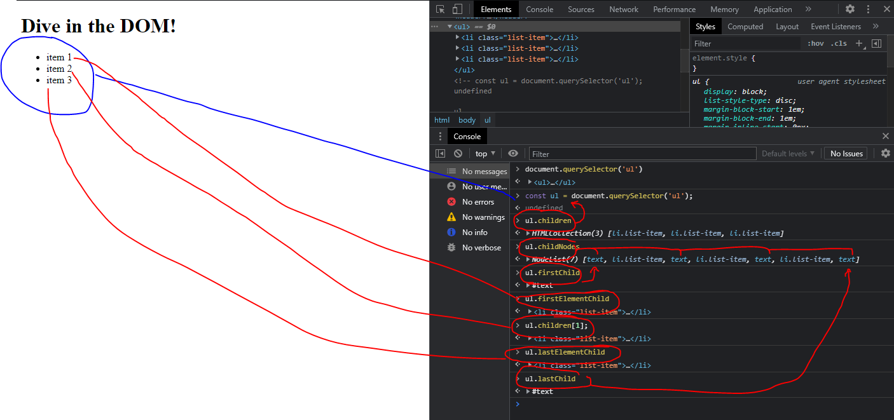

|   |   |   |   
|---|---|---|
|`ul.children`|`ul.children[1]`|`li.parentElement`|   
|`ul.childNodes`|`ul.lastElementChild`|`li.closest('body')`|   
|`ul.firstChild`|`ul.lastChild`|`ul.previosElementSibling`|   
|`ul.firstElementChild`|`li.parentNode`|`ul.nextElementSibling`|   

# working-with-DOM

Here's a summary of the various methods you got to reach out to DOM elements (note: you can only query for element nodes).

Besides the below query methods, you also got these special properties on the document object to select parts of the document:

`document.body` => Selects the `<body>` element node.

`document.head` => Selects the `<head>` element node.

`document.documentElement` => Selects the `<html>` element node

---

QUERY METHODS

---

## `document.querySelector(<CSS selector>);`

Takes any CSS selector `(e.g. '#some-id', '.some-class' or 'div p.some-class')` and returns the first (!) matching element in the DOM. Returns `null` if no matching element could be found.

More information: https://developer.mozilla.org/en-US/docs/Web/API/Document/querySelector

## `document.getElementById(<ID>);`

Takes an ID (without `#`, just the id name) and returns the element that has this id. Since the same ID shouldn't occur more than once on your page, it'll always return exactly that one element. Returns `null` if no element with the specified ID could be found.

More information: https://developer.mozilla.org/en-US/docs/Web/API/Document/getElementById

## `document.querySelectorAll(<CSS selector>);`

Takes any CSS selector `(e.g. '#some-id', '.some-class' or 'div p.some-class')` and returns all matching elements in the DOM as a static (non-live) `NodeLis`t. Returns and empty `NodeList` if no matching element could be found.

More information: https://developer.mozilla.org/en-US/docs/Web/API/Document/querySelectorAll

## `document.getElementsByClassName(<CSS CLASS>);`

Takes a CSS class g `(e.g. 'some-class')` and returns a live `HTMLCollection` of matched elements in your DOM. Returns an empty `HTMLCollection` if not matching elements were found.

More information: https://developer.mozilla.org/en-US/docs/Web/API/Document/getElementsByClassName

## `document.getElementsByTagName(<HTML TAG>);`

Takes an HTML tag `(e.g. 'p')` and returns a live `HTMLCollection` of matched elements in your DOM. Returns an empty HTMLCollection if not matching elements were found.

More information: https://developer.mozilla.org/en-US/docs/Web/API/Element/getElementsByTagName

There also is the `getElementsByName()` method which really isn't used commonly (https://developer.mozilla.org/en-US/docs/Web/API/Document/getElementsByName).


# CREATING ELEMENTS & ADDING THEM

### CREATING ELEMENT
```
<ul>
<li>1st item</li>
<li>2nd item</li>
<li>3rd item</li>
<li>4rd item</li>
<li>5th item</li>
</ul>
```

Console debug
```
const list = document.querySelector('ul');
const newLi = document.createElement('li');
newLi.style.backgroundColor = 'blue'; //Give it style "the style can still be edited separately"
newLi.textContent = '6th item'; //give it some content
list.appendChild(newLi); //attach it to node.
```


### InsertAdjacentHTML
for ```element.insertAdjacentHTML(position, text);``` the position available are the following:

```
<!-- beforebegin -->
<p>
    <!-- afterbegin -->
    foo
    <!-- beforeend -->
</p>
<!-- afterend -->
```

|Re-Renders document|Live Updating|   |
|---|---|
|```section.innerHTML = '<h2>A new title!</h2>';```|```div.insertAdjacentHTML('beforeend', <p>Something went wrong!</p>'```|   |
|```section.innerHTML = section + '<h2>A new title!</h2>';```|   |
|   |   |


| Re-renders Document 	| Live Update 	|
|---------------------	|-------------	|
| ```section.innerHTML = '<h2>A new title!</h2>';```                   	| ```div.insertAdjacentHTML('beforeend', <p>Something went wrong!</p>'```          	|
| ```section.innerHTML = section + '<h2>A new title!</h2>';```                  	|            	|